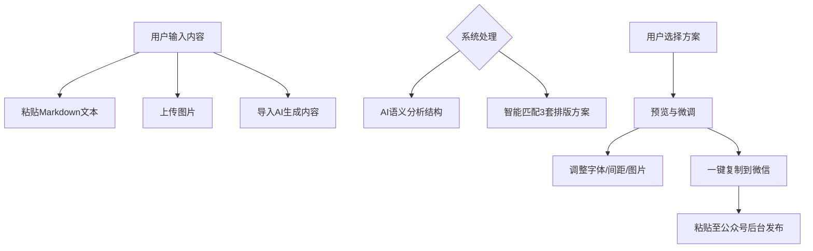

<thinking>用户现在需要我生成一份专业的产品需求文档（PRD），涵盖产品愿景、目标用户、核心功能、高级功能、KPI、用户流程等。首先，我需要回顾之前的对话，确保PRD与之前的探讨一致。之前提到的是面向中文内容创作者的微信公众号AI排版工具，核心痛点是效率与品质的矛盾，AI生成内容后的排版断层，以及设计能力不足。产品定位是“AI驱动的内容感知型排版引擎”，核心价值是智能、美学、高效。

首先，PRD的结构需要清晰，通常包括产品概述、目标用户、核心功能、高级功能、用户流程、KPI、技术需求、风险与应对等部分。需要确保每个部分都覆盖用户提到的要点，并且细节具体，可落地。

产品愿景部分，需要明确产品的长期目标，比如成为中文内容创作者的“排版基础设施”，解决AIGC内容到公众号发布的“最后一公里”问题。目标用户要细分，之前提到职业创作者，可能需要分不同角色，比如自媒体人、企业新媒体编辑、垂直领域博主，每个角色的需求和痛点可能不同，需要详细描述。

核心功能是MVP阶段的重点，之前提到输入端（Markdown支持、图片上传）、AI语义分析（识别标题、引用、列表）、智能模板匹配（根据内容结构动态匹配布局）、预览与微调（轻量化编辑器）、输出端（一键复制到微信）。需要把这些功能拆分成具体的功能点，包括功能描述、用户场景、验收标准。

高级功能是后续迭代的，比如品牌风格定制（自定义字体、配色）、行业垂直模板（金融、教育等）、数据驱动优化（根据阅读数据调整排版）、社区模板市场（用户分享模板）。这些需要说明优先级和实现路径。

用户流程需要画主要流程，比如“内容排版全流程”，从用户输入内容到输出到微信，每个步骤的操作和系统反馈。KPI要分短期（上线3个月）、中期（6个月）、长期（1年），包括用户数、留存率、转化率（免费到Pro）、排版效率提升等指标。

还要考虑技术需求，比如AI模型（中文NLP模型微调）、编辑器技术（Slate.js）、兼容性（微信编辑器适配）。风险部分，比如用户对AI排版的信任问题、微信生态的政策风险、数据安全（用户内容处理），需要提出应对策略。

需要注意PRD的专业性，使用清晰的结构，每个功能点有明确的用户场景和验收标准，避免模糊描述。同时，结合之前的竞争对手分析，确保功能有差异化，比如智能模板匹配对比传统模板编辑器，品牌定制对比腾讯原生工具。

现在需要把这些内容组织成结构化的PRD，确保覆盖所有用户要求的部分，并且逻辑连贯，细节具体，可指导开发。</thinking>

# 产品需求文档 (PRD)：微信公众号AI排版工具「文优」  

## **1. 产品概述**  
### 1.1 产品名称  
文优（暂定名，寓意“让文字排版更优”）  

### 1.2 产品愿景  
成为中文内容创作者的“排版基础设施”，通过AI驱动的“内容感知型排版引擎”，解决AIGC内容到微信公众号发布的“最后一公里”效率与品质矛盾，让创作者专注内容价值，而非排版琐碎。  

### 1.3 产品定位  
**核心定位**：面向中文职业内容创作者的AI驱动型微信公众号排版工具，主打“智能（内容感知）、美学（专业设计）、高效（一键输出）”三大价值。  
**差异化**：区别于传统模板编辑器（秀米/135）的“手动搭积木”、通用设计工具（Canva）的“高门槛适配”，聚焦“内容决定排版”的智能动态生成，适配微信生态的无缝输出。  

## **2. 目标用户与痛点**  
### 2.1 用户画像  
| 用户角色           | 典型特征                                                     | 核心痛点                                                     |
| ------------------ | ------------------------------------------------------------ | ------------------------------------------------------------ |
| **自媒体人**       | 个人运营公众号（如科技/情感/职场博主），日均1篇推文，非设计背景，追求“快速出好文”。 | 1. AI生成内容后需手动拆解结构、套用模板，耗时1-2小时； 2. 模板同质化，难以形成个人风格。 |
| **企业新媒体编辑** | 团队运营企业公众号（如互联网公司/品牌方），需保持30+账号矩阵排版一致性，考核“阅读量/转发率”。 | 1. 多账号风格统一难，手动调整字体/配色易出错； 2. 长文（如产品手册）排版效率低，影响发布节奏。 |
| **垂直领域博主**   | 专业领域创作者（如金融/教育/医疗），内容含大量数据/公式/专业术语，需体现“专业感”。 | 1. 表格/数据图表排版混乱，微信编辑器支持差； 2. 非设计出身，对字体/配色搭配缺乏信心。 |

### 2.2 核心痛点总结  
- **效率断层**：AIGC生成的无格式文本 → 微信排版需手动拆解结构、套用样式，阻断AI提效链路；  
- **品质焦虑**：非设计用户难以把控字体/配色/间距的专业性，担心排版粗糙影响内容可信度；  
- **一致性难**：多账号/多文章的品牌风格（字体/配色/布局）难以统一，手动调整易出错。  

## **3. 核心功能（MVP阶段，1-3个月）**  
### 3.1 功能模块概览  
| 模块名称         | 核心功能点                                                   | 优先级 |
| ---------------- | ------------------------------------------------------------ | ------ |
| **内容输入端**   | Markdown文本粘贴、图片上传与智能分类（头图/插图）、AI内容导入（支持主流大模型API） | P0     |
| **AI语义分析**   | 自动识别标题层级（H1-H3）、引用块、列表（有序/无序）、数据段落（含数字/公式） | P0     |
| **智能模板匹配** | 根据内容结构（长文/短图文）、风格偏好（极简/商务/活泼）动态生成排版方案（3套候选） | P0     |
| **预览与微调**   | 实时预览排版效果、轻量化编辑器（调整字体/间距/图片位置，无需代码） | P0     |
| **微信输出端**   | 一键复制排版结果、微信编辑器格式适配（确保样式不丢失）、历史排版记录 | P0     |

### 3.2 功能详情  

#### **3.2.1 内容输入端**  
- **功能描述**：支持用户输入原始内容（文本+图片），自动保留基础格式，降低前期操作成本。  
- **用户场景**：  
  - 自媒体人小王用ChatGPT生成一篇3000字科技文，复制Markdown文本粘贴至“文优”，工具自动保留标题（#）、引用（>）、列表（-）格式；  
  - 企业编辑小李上传5张产品图，工具自动识别“尺寸最大、内容完整”的图为“头图候选”，其余标记为“插图”。  
- **验收标准**：  
  - 支持Markdown语法（#/##/###、>、-/*、**加粗**、[链接]()），粘贴后格式保留率≥95%；  
  - 图片上传支持JPG/PNG/WEBP格式，自动压缩至微信公众号推荐尺寸（头图900*500px，插图≤1080px宽）。  

#### **3.2.2 AI语义分析**  
- **功能描述**：通过NLP模型分析文本逻辑结构，输出结构化数据，为排版布局提供依据。  
- **技术依赖**：基于BERT中文模型微调，训练数据为10万+优质微信公众号文章（标注标题层级、段落类型、重点内容）。  
- **用户场景**：  
  - 金融博主小张输入含“2023年GDP增速6.3%”“CPI同比上涨2.1%”的数据段落，工具识别为“数据型段落”，自动匹配“左侧数据+右侧解读”的双栏布局。  
- **验收标准**：  
  - 标题层级（H1-H3）识别准确率≥90%；  
  - 引用块、列表、数据段落识别准确率≥85%。  

#### **3.2.3 智能模板匹配**  
- **功能描述**：根据内容结构（如“多标题长文”“图文穿插短图文”）和用户选择的风格，动态生成3套排版方案，用户可一键切换。  
- **风格预设**：极简（无装饰，黑灰白为主）、商务（深蓝色系，标题加粗）、活泼（彩色分割线，圆角图片）。  
- **用户场景**：  
  - 教育博主小陈选择“活泼”风格，工具自动为标题添加橙色下划线，图片设置圆角边框，列表项用卡通图标替代默认圆点。  
- **验收标准**：  
  - 生成3套方案耗时≤5秒；  
  - 方案布局适配内容结构（如长文自动用单栏+分段留白，图文混排用双栏穿插）。  

#### **3.2.4 预览与微调**  
- **功能描述**：提供微信公众号界面1:1预览，支持轻量化手动调整，满足个性化需求。  
- **可调整项**：字体大小（14-18px）、行间距（1.5-2倍）、图片位置（居中/左对齐/右对齐）、段落背景色（预设品牌色板）。  
- **用户场景**：  
  - 企业编辑小李预览时发现某段重点内容不够突出，手动将背景色改为品牌主色（#0066FF），工具实时同步预览效果。  
- **验收标准**：  
  - 预览界面与微信公众号后台预览差异率≤5%；  
  - 单次调整操作步骤≤3步（如“选段落→点背景色→选颜色”）。  

#### **3.2.5 微信输出端**  
- **功能描述**：一键复制排版结果，粘贴至微信公众号后台时样式完整保留，支持历史记录回溯。  
- **技术方案**：输出符合微信规范的HTML代码（过滤微信不支持的CSS样式，如flex布局→转为table布局）。  
- **用户场景**：  
  - 自媒体人小王点击“复制到微信”，打开公众号后台粘贴，排版效果与预览完全一致，无需二次调整。  
- **验收标准**：  
  - 粘贴后样式（字体/颜色/间距/图片位置）保留率≥98%；  
  - 历史记录支持按“日期/风格”检索，保存最近30条排版数据。  

## **4. 高级功能（迭代阶段，4-12个月）**  
### 4.1 品牌风格定制（Pro版核心功能）  
- **功能**：支持用户上传品牌字体（TTF/OTF格式）、保存品牌色板（主色/辅助色/强调色），设置默认布局规则（如“所有H1标题加粗+居中”）。  
- **价值**：企业用户可确保30+账号矩阵排版一致性，减少跨团队沟通成本。  

### 4.2 行业垂直模板  
- **功能**：针对金融（数据图表排版）、教育（课程大纲/习题排版）、医疗（科普长图分段）开发专属智能模板。  
- **示例**：金融模板自动识别表格数据，生成微信兼容的可视化图表（折线图/柱状图），支持点击展开详情。  

### 4.3 数据驱动优化  
- **功能**：对接微信公众号后台数据API，分析用户文章的“阅读时长分布”“重点段落停留时间”，自动优化排版（如延长高停留段落的行间距、放大低停留段落的字号）。  

### 4.4 社区模板市场  
- **功能**：用户可分享自定义智能模板（含语义规则、美学参数），优质模板可定价售卖（平台与创作者7:3分成）。  
- **价值**：构建UGC生态，形成“用户创作模板→吸引新用户→更多模板”的增长飞轮。  

## **5. 用户流程**  
### 5.1 核心流程：内容排版全流程  

## **6. 关键指标（KPI）**  
### 6.1 短期（上线3个月）  
- **用户量**：注册用户≥10万，日活用户≥1万；  
- **效率提升**：用户平均排版时间从1小时压缩至10分钟以内（效率提升83%）；  
- **留存率**：次日留存≥40%，7日留存≥25%。  

### 6.2 中期（6个月）  
- **商业化**：Pro版付费转化率≥5%（目标用户：企业新媒体团队、垂直领域博主）；  
- **内容生态**：用户主动分享模板≥1000个，模板市场月交易流水≥10万元；  
- **口碑**：用户NPS（净推荐值）≥40。  

### 6.3 长期（1年）  
- **市场份额**：成为微信公众号排版工具Top3（按用户数），职业创作者覆盖率≥30%；  
- **技术壁垒**：AI语义分析准确率≥95%，形成专有“中文排版数据模型”。  

## **7. 技术需求**  
### 7.1 AI模型  
- 基础模型：BERT中文预训练模型（用于语义结构识别）；  
- 训练数据：10万+优质微信公众号文章（标注结构/布局/风格标签）；  
- 部署：轻量化模型（推理耗时≤5秒），支持云端API调用。  

### 7.2 编辑器技术  
- 前端框架：React + Slate.js（实现富文本编辑与实时预览）；  
- 微信适配：开发微信编辑器格式兼容层（过滤非法CSS，转换布局为微信支持的table/inline样式）。  

### 7.3 数据安全  
- 用户内容加密存储，仅用于排版处理，不做商业用途；  
- 符合《个人信息保护法》，明确用户数据所有权。  

## **8. 风险与应对**  
| 风险类型         | 具体描述                                       | 应对策略                                                     |
| ---------------- | ---------------------------------------------- | ------------------------------------------------------------ |
| **用户信任风险** | 初期用户担心AI排版“不可控”，偏好手动调整。     | 1. 提供“AI建议+人工确认”流程（生成3套方案供选择）； 2. 开发“风格记忆”功能，学习用户微调习惯。 |
| **微信生态风险** | 微信调整编辑器接口，导致排版样式丢失。         | 1. 建立微信版本兼容性测试机制（覆盖95%以上用户使用的微信版本）； 2. 开发微信小程序插件，直接在公众号后台调用。 |
| **竞争风险**     | 腾讯推出原生AI排版工具，依托生态优势挤压市场。 | 聚焦垂直深度：开发企业级品牌定制、行业垂直模板，与腾讯“大众工具”形成差异化。 |

## **9. 产品规划路线图**  
| 阶段  | 时间    | 核心目标           | 关键功能                                        |
| ----- | ------- | ------------------ | ----------------------------------------------- |
| MVP   | 1-3月   | 验证AI排版效率价值 | 内容输入、AI语义分析、智能模板匹配、微信输出    |
| 迭代1 | 4-6月   | 企业用户转化       | 品牌风格定制、团队协作（多账号管理）            |
| 迭代2 | 7-9月   | 行业渗透           | 金融/教育/医疗垂直模板、数据驱动优化            |
| 迭代3 | 10-12月 | 生态构建           | 社区模板市场、API开放平台（对接第三方AIGC工具） |

**附件**：UI线框图、AI模型训练数据集说明、微信编辑器兼容性测试报告（略）  

**文档版本**：V1.0  
**编制日期**：2023年XX月XX日  
**编制人**：[产品团队]